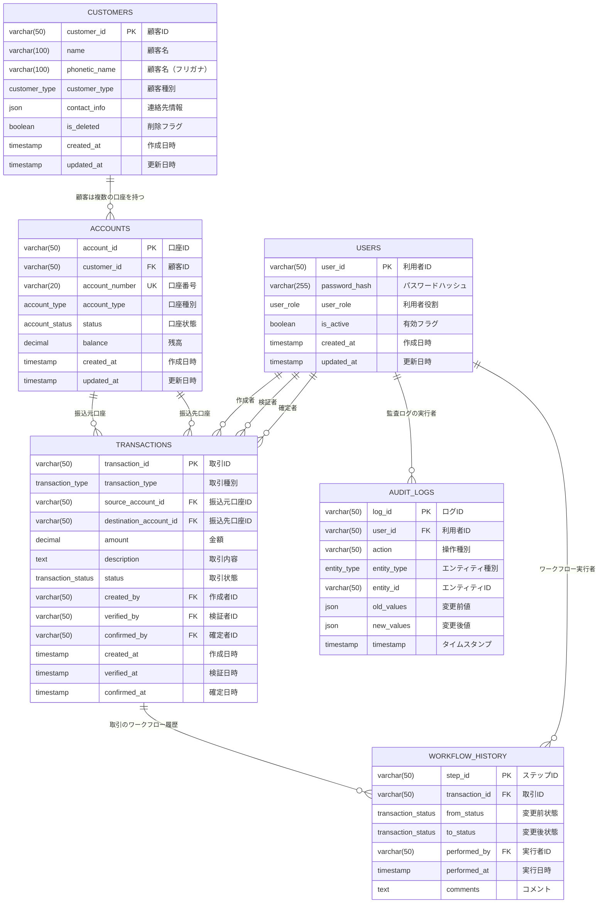

# 金融系業務アプリケーション「ゴブコパ」ER図

## 概要

本ドキュメントは、金融系業務アプリケーション「ゴブコパ」のデータベース設計を示すEntity-Relationship図です。PostgreSQLを使用し、Prisma ORMによって管理されています。

## ER図



## テーブル詳細

### 1. USERS（利用者テーブル）

| カラム名      | データ型     | 制約          | 説明                             |
| ------------- | ------------ | ------------- | -------------------------------- |
| user_id       | VARCHAR(50)  | PK            | 利用者ID                         |
| password_hash | VARCHAR(255) | NOT NULL      | bcryptハッシュ化されたパスワード |
| user_role     | ENUM         | NOT NULL      | 利用者役割（一般職員/管理者）    |
| is_active     | BOOLEAN      | DEFAULT true  | アカウント有効フラグ             |
| created_at    | TIMESTAMP    | DEFAULT now() | 作成日時                         |
| updated_at    | TIMESTAMP    | AUTO UPDATE   | 更新日時                         |

**インデックス:**

- `user_role`
- `is_active`

### 2. CUSTOMERS（顧客テーブル）

| カラム名      | データ型     | 制約          | 説明                         |
| ------------- | ------------ | ------------- | ---------------------------- |
| customer_id   | VARCHAR(50)  | PK            | 顧客ID                       |
| name          | VARCHAR(100) | NOT NULL      | 顧客名                       |
| phonetic_name | VARCHAR(100) | NOT NULL      | 顧客名（フリガナ）           |
| customer_type | ENUM         | NOT NULL      | 顧客種別（個人/法人）        |
| contact_info  | JSON         | NULL          | 連絡先情報（メール、電話等） |
| is_deleted    | BOOLEAN      | DEFAULT false | 論理削除フラグ               |
| created_at    | TIMESTAMP    | DEFAULT now() | 作成日時                     |
| updated_at    | TIMESTAMP    | AUTO UPDATE   | 更新日時                     |

**インデックス:**

- `name`
- `phonetic_name`
- `customer_type`
- `is_deleted`
- 複合インデックス: `(name, phonetic_name, customer_type)`

### 3. ACCOUNTS（口座テーブル）

| カラム名       | データ型      | 制約          | 説明                       |
| -------------- | ------------- | ------------- | -------------------------- |
| account_id     | VARCHAR(50)   | PK            | 口座ID                     |
| customer_id    | VARCHAR(50)   | FK            | 顧客ID                     |
| account_number | VARCHAR(20)   | UNIQUE        | 口座番号                   |
| account_type   | ENUM          | NOT NULL      | 口座種別（普通/当座/定期） |
| status         | ENUM          | NOT NULL      | 口座状態（有効/閉鎖/停止） |
| balance        | DECIMAL(15,2) | DEFAULT 0.00  | 残高                       |
| created_at     | TIMESTAMP     | DEFAULT now() | 作成日時                   |
| updated_at     | TIMESTAMP     | AUTO UPDATE   | 更新日時                   |

**インデックス:**

- `customer_id`
- `account_number`
- `account_type`
- `status`
- 複合インデックス: `(customer_id, status)`

### 4. TRANSACTIONS（取引テーブル）

| カラム名               | データ型      | 制約          | 説明                       |
| ---------------------- | ------------- | ------------- | -------------------------- |
| transaction_id         | VARCHAR(50)   | PK            | 取引ID                     |
| transaction_type       | ENUM          | NOT NULL      | 取引種別（振込/入金/出金） |
| source_account_id      | VARCHAR(50)   | FK, NULL      | 振込元口座ID               |
| destination_account_id | VARCHAR(50)   | FK, NULL      | 振込先口座ID               |
| amount                 | DECIMAL(15,2) | NOT NULL      | 金額                       |
| description            | TEXT          | NULL          | 取引内容                   |
| status                 | ENUM          | NOT NULL      | 取引状態                   |
| created_by             | VARCHAR(50)   | FK            | 作成者ID                   |
| verified_by            | VARCHAR(50)   | FK, NULL      | 検証者ID                   |
| confirmed_by           | VARCHAR(50)   | FK, NULL      | 確定者ID                   |
| created_at             | TIMESTAMP     | DEFAULT now() | 作成日時                   |
| verified_at            | TIMESTAMP     | NULL          | 検証日時                   |
| confirmed_at           | TIMESTAMP     | NULL          | 確定日時                   |

**インデックス:**

- `status`
- `created_by`
- `source_account_id`
- `destination_account_id`
- `created_at`

### 5. WORKFLOW_HISTORY（ワークフロー履歴テーブル）

| カラム名       | データ型    | 制約          | 説明       |
| -------------- | ----------- | ------------- | ---------- |
| step_id        | VARCHAR(50) | PK            | ステップID |
| transaction_id | VARCHAR(50) | FK            | 取引ID     |
| from_status    | ENUM        | NULL          | 変更前状態 |
| to_status      | ENUM        | NOT NULL      | 変更後状態 |
| performed_by   | VARCHAR(50) | FK            | 実行者ID   |
| performed_at   | TIMESTAMP   | DEFAULT now() | 実行日時   |
| comments       | TEXT        | NULL          | コメント   |

**インデックス:**

- `transaction_id`
- `performed_by`
- `performed_at`

### 6. AUDIT_LOGS（監査ログテーブル）

| カラム名    | データ型    | 制約          | 説明             |
| ----------- | ----------- | ------------- | ---------------- |
| log_id      | VARCHAR(50) | PK            | ログID           |
| user_id     | VARCHAR(50) | FK            | 利用者ID         |
| action      | VARCHAR(50) | NOT NULL      | 操作種別         |
| entity_type | ENUM        | NOT NULL      | エンティティ種別 |
| entity_id   | VARCHAR(50) | NOT NULL      | エンティティID   |
| old_values  | JSON        | NULL          | 変更前値         |
| new_values  | JSON        | NULL          | 変更後値         |
| timestamp   | TIMESTAMP   | DEFAULT now() | タイムスタンプ   |

**インデックス:**

- `user_id`
- `(entity_type, entity_id)`
- `timestamp`
- `action`

## ENUM定義

### UserRole（利用者役割）

- `GENERAL_STAFF`: 一般職員
- `ADMINISTRATOR`: 管理者

### CustomerType（顧客種別）

- `INDIVIDUAL`: 個人
- `CORPORATE`: 法人

### AccountType（口座種別）

- `SAVINGS`: 普通預金
- `CHECKING`: 当座預金
- `FIXED_DEPOSIT`: 定期預金

### AccountStatus（口座状態）

- `ACTIVE`: 有効
- `CLOSED`: 閉鎖
- `SUSPENDED`: 停止

### TransactionType（取引種別）

- `TRANSFER`: 振込
- `DEPOSIT`: 入金
- `WITHDRAWAL`: 出金

### TransactionStatus（取引状態）

- `PENDING_VERIFICATION`: 検証待ち
- `VERIFICATION_COMPLETE`: 検証完了
- `ON_HOLD`: 保留中
- `RETURNED_FOR_CORRECTION`: 修正返戻
- `CONFIRMED`: 確定
- `CANCELLED`: 取消

### EntityType（エンティティ種別）

- `CUSTOMER`: 顧客
- `ACCOUNT`: 口座
- `TRANSACTION`: 取引
- `USER`: 利用者

## リレーション詳細

### 1. 顧客 - 口座関係（1:N）

- 1人の顧客は複数の口座を持つことができる
- 口座は必ず1人の顧客に属する
- 外部キー: `accounts.customer_id` → `customers.customer_id`

### 2. 口座 - 取引関係（1:N）

- 1つの口座は複数の取引の振込元または振込先になることができる
- 取引は振込元口座と振込先口座を持つ（取引種別により片方がNULL）
- 外部キー:
  - `transactions.source_account_id` → `accounts.account_id`
  - `transactions.destination_account_id` → `accounts.account_id`

### 3. 利用者 - 取引関係（1:N）

- 1人の利用者は複数の取引を作成・検証・確定できる
- 取引は作成者、検証者、確定者の情報を持つ
- 外部キー:
  - `transactions.created_by` → `users.user_id`
  - `transactions.verified_by` → `users.user_id`
  - `transactions.confirmed_by` → `users.user_id`

### 4. 取引 - ワークフロー履歴関係（1:N）

- 1つの取引は複数のワークフローステップを持つ
- ワークフロー履歴は取引の状態変更を記録
- 外部キー: `workflow_history.transaction_id` → `transactions.transaction_id`

### 5. 利用者 - ワークフロー履歴関係（1:N）

- 1人の利用者は複数のワークフローステップを実行できる
- 外部キー: `workflow_history.performed_by` → `users.user_id`

### 6. 利用者 - 監査ログ関係（1:N）

- 1人の利用者は複数の監査ログを生成する
- 外部キー: `audit_logs.user_id` → `users.user_id`

## データ整合性制約

### 業務ルール制約

1. **取引種別による口座制約**
   - `TRANSFER`: 振込元・振込先口座の両方が必須
   - `DEPOSIT`: 振込先口座のみ必須（振込元はNULL）
   - `WITHDRAWAL`: 振込元口座のみ必須（振込先はNULL）

2. **取引状態遷移制約**
   - 状態遷移は定められたフローに従う必要がある
   - 逆方向の遷移は基本的に禁止

3. **権限制約**
   - 確定処理は管理者のみ実行可能
   - 自分が作成した取引は自分で検証できない

### データベース制約

1. **CHECK制約**

   ```sql
   -- 金額は正の値のみ
   ALTER TABLE transactions ADD CONSTRAINT chk_amount_positive
   CHECK (amount > 0);

   -- 残高は0以上
   ALTER TABLE accounts ADD CONSTRAINT chk_balance_non_negative
   CHECK (balance >= 0);
   ```

2. **トリガー制約**
   - 取引確定時の残高更新
   - 監査ログの自動生成
   - ワークフロー履歴の自動記録

## パフォーマンス考慮事項

### インデックス戦略

1. **検索頻度の高い項目**
   - 顧客名・フリガナ（部分一致検索）
   - 口座番号（完全一致検索）
   - 取引日時（範囲検索）

2. **複合インデックス**
   - `(customer_id, status)`: 顧客別の有効口座検索
   - `(name, phonetic_name, customer_type)`: 顧客検索

3. **パーティショニング検討**
   - 取引テーブル: 月別パーティション
   - 監査ログテーブル: 月別パーティション

### クエリ最適化

1. **N+1問題対策**
   - Prismaの`include`を適切に使用
   - バッチクエリの活用

2. **大量データ処理**
   - ページネーション実装
   - インデックスヒント使用

## セキュリティ考慮事項

### データ保護

1. **機密情報の暗号化**
   - パスワードハッシュ（bcrypt）
   - 連絡先情報（必要に応じて）

2. **アクセス制御**
   - Row Level Security（RLS）の検討
   - ビューによるデータマスキング

3. **監査証跡**
   - 全データ変更の記録
   - ユーザー操作の追跡

### バックアップ・復旧

1. **定期バックアップ**
   - 日次フルバックアップ
   - 時間別差分バックアップ

2. **災害復旧**
   - レプリケーション設定
   - Point-in-Time Recovery

---

**更新履歴**

- 2024-01-11: 初版作成
- ER図の詳細化
- 制約条件の明確化
- パフォーマンス考慮事項の追加
