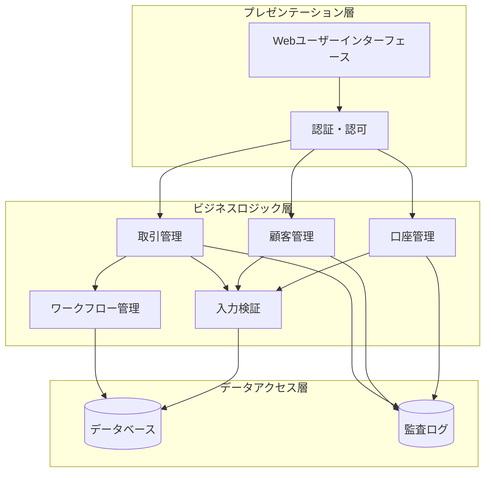

# 設計文書

## 概要

金融系業務アプリケーションは、銀行業務における多段階取引処理ワークフローを実装する Web ベースのアプリケーションです。本システムは、一次入力、ダブルチェック、確定処理の 3 段階承認プロセスを通じて、金融取引の適切な統制と監査証跡を提供します。

### 主要設計原則

- **二重統制**: すべての金融取引は複数の職員による承認を必要とする
- **監査証跡**: すべての操作は完全な履歴とタイムスタンプで記録される
- **データ整合性**: アトミック操作により残高更新の一貫性を保証する
- **役割ベースアクセス**: 利用者の役割に応じた機能制限を実装する
- **入力検証**: 包括的な検証により不正データの入力を防止する

## アーキテクチャ

### システム構成

本システムは 3 層アーキテクチャを採用します：



### 技術スタック

- **フロントエンド**: HTML5, CSS3, JavaScript (ES6+)
- **バックエンド**: Node.js with Express.js
- **データベース**: PostgreSQL
- **認証**: JWT (JSON Web Tokens)
- **セッション管理**: Redis
- **ログ管理**: Winston

## コンポーネントとインターフェース

### 1. 認証・認可コンポーネント

```typescript
interface AuthenticationService {
  login(userId: string, password: string): Promise<AuthResult>;
  logout(sessionId: string): Promise<void>;
  switchUser(
    currentSession: string,
    newUserId: string,
    password: string
  ): Promise<AuthResult>;
  validateSession(sessionId: string): Promise<UserSession>;
}

interface AuthResult {
  success: boolean;
  sessionId?: string;
  userRole?: UserRole;
  errorMessage?: string;
}

enum UserRole {
  GENERAL_STAFF = 'general_staff',
  ADMINISTRATOR = 'administrator',
}
```

### 2. 顧客管理コンポーネント

```typescript
interface CustomerService {
  createCustomer(customerData: CustomerData): Promise<Customer>;
  updateCustomer(
    customerId: string,
    updates: Partial<CustomerData>
  ): Promise<Customer>;
  deleteCustomer(customerId: string): Promise<void>;
  getCustomer(customerId: string): Promise<Customer>;
  searchCustomers(criteria: CustomerSearchCriteria): Promise<Customer[]>;
  listCustomers(
    pagination: PaginationOptions
  ): Promise<PaginatedResult<Customer>>;
}

interface Customer {
  customerId: string;
  name: string;
  phoneticName: string;
  customerType: CustomerType;
  contactInfo: ContactInfo;
  createdAt: Date;
  updatedAt: Date;
  isDeleted: boolean;
}

enum CustomerType {
  INDIVIDUAL = 'individual',
  CORPORATE = 'corporate',
}
```

### 3. 口座管理コンポーネント

```typescript
interface AccountService {
  openAccount(customerId: string, accountData: AccountData): Promise<Account>;
  updateAccount(
    accountId: string,
    updates: Partial<AccountData>
  ): Promise<Account>;
  closeAccount(accountId: string): Promise<void>;
  getAccount(accountId: string): Promise<Account>;
  getAccountsByCustomer(customerId: string): Promise<Account[]>;
  searchAccounts(criteria: AccountSearchCriteria): Promise<Account[]>;
  getAccountBalance(accountId: string): Promise<AccountBalance>;
}

interface Account {
  accountId: string;
  customerId: string;
  accountNumber: string;
  accountType: AccountType;
  status: AccountStatus;
  balance: number;
  createdAt: Date;
  updatedAt: Date;
}

enum AccountStatus {
  ACTIVE = 'active',
  CLOSED = 'closed',
  SUSPENDED = 'suspended',
}
```

### 4. 取引管理コンポーネント

```typescript
interface TransactionService {
  createTransaction(transactionData: TransactionInput): Promise<Transaction>;
  getTransactionsPendingVerification(): Promise<Transaction[]>;
  verifyTransaction(
    transactionId: string,
    verification: TransactionVerification
  ): Promise<void>;
  getTransactionsReadyForConfirmation(): Promise<Transaction[]>;
  confirmTransaction(transactionId: string): Promise<TransactionResult>;
  cancelTransaction(transactionId: string): Promise<void>;
  getTransactionHistory(
    criteria: TransactionSearchCriteria
  ): Promise<Transaction[]>;
}

interface Transaction {
  transactionId: string;
  type: TransactionType;
  sourceAccountId?: string;
  destinationAccountId?: string;
  amount: number;
  description: string;
  status: TransactionStatus;
  createdBy: string;
  verifiedBy?: string;
  confirmedBy?: string;
  createdAt: Date;
  verifiedAt?: Date;
  confirmedAt?: Date;
}

enum TransactionType {
  TRANSFER = 'transfer',
  DEPOSIT = 'deposit',
  WITHDRAWAL = 'withdrawal',
}

enum TransactionStatus {
  PENDING_VERIFICATION = 'pending_verification',
  VERIFICATION_COMPLETE = 'verification_complete',
  ON_HOLD = 'on_hold',
  RETURNED_FOR_CORRECTION = 'returned_for_correction',
  CONFIRMED = 'confirmed',
  CANCELLED = 'cancelled',
}
```

### 5. ワークフロー管理コンポーネント

```typescript
interface WorkflowService {
  validateTransactionTransition(
    transactionId: string,
    newStatus: TransactionStatus,
    userId: string
  ): Promise<boolean>;
  enforceDoubleCheckRule(
    transactionId: string,
    verifyingUserId: string
  ): Promise<boolean>;
  processStatusChange(
    transactionId: string,
    newStatus: TransactionStatus,
    comments?: string
  ): Promise<void>;
  getWorkflowHistory(transactionId: string): Promise<WorkflowStep[]>;
}

interface WorkflowStep {
  stepId: string;
  transactionId: string;
  fromStatus: TransactionStatus;
  toStatus: TransactionStatus;
  performedBy: string;
  performedAt: Date;
  comments?: string;
}
```

## データモデル

### データベーススキーマ

```sql
-- 利用者テーブル
CREATE TABLE users (
    user_id VARCHAR(50) PRIMARY KEY,
    password_hash VARCHAR(255) NOT NULL,
    user_role VARCHAR(20) NOT NULL,
    is_active BOOLEAN DEFAULT true,
    created_at TIMESTAMP DEFAULT CURRENT_TIMESTAMP,
    updated_at TIMESTAMP DEFAULT CURRENT_TIMESTAMP
);

-- 顧客テーブル
CREATE TABLE customers (
    customer_id VARCHAR(50) PRIMARY KEY,
    name VARCHAR(100) NOT NULL,
    phonetic_name VARCHAR(100) NOT NULL,
    customer_type VARCHAR(20) NOT NULL,
    contact_info JSONB,
    is_deleted BOOLEAN DEFAULT false,
    created_at TIMESTAMP DEFAULT CURRENT_TIMESTAMP,
    updated_at TIMESTAMP DEFAULT CURRENT_TIMESTAMP
);

-- 口座テーブル
CREATE TABLE accounts (
    account_id VARCHAR(50) PRIMARY KEY,
    customer_id VARCHAR(50) REFERENCES customers(customer_id),
    account_number VARCHAR(20) UNIQUE NOT NULL,
    account_type VARCHAR(20) NOT NULL,
    status VARCHAR(20) NOT NULL,
    balance DECIMAL(15,2) DEFAULT 0.00,
    created_at TIMESTAMP DEFAULT CURRENT_TIMESTAMP,
    updated_at TIMESTAMP DEFAULT CURRENT_TIMESTAMP
);

-- 取引テーブル
CREATE TABLE transactions (
    transaction_id VARCHAR(50) PRIMARY KEY,
    transaction_type VARCHAR(20) NOT NULL,
    source_account_id VARCHAR(50) REFERENCES accounts(account_id),
    destination_account_id VARCHAR(50) REFERENCES accounts(account_id),
    amount DECIMAL(15,2) NOT NULL,
    description TEXT,
    status VARCHAR(30) NOT NULL,
    created_by VARCHAR(50) REFERENCES users(user_id),
    verified_by VARCHAR(50) REFERENCES users(user_id),
    confirmed_by VARCHAR(50) REFERENCES users(user_id),
    created_at TIMESTAMP DEFAULT CURRENT_TIMESTAMP,
    verified_at TIMESTAMP,
    confirmed_at TIMESTAMP
);

-- ワークフロー履歴テーブル
CREATE TABLE workflow_history (
    step_id VARCHAR(50) PRIMARY KEY,
    transaction_id VARCHAR(50) REFERENCES transactions(transaction_id),
    from_status VARCHAR(30),
    to_status VARCHAR(30) NOT NULL,
    performed_by VARCHAR(50) REFERENCES users(user_id),
    performed_at TIMESTAMP DEFAULT CURRENT_TIMESTAMP,
    comments TEXT
);

-- 監査ログテーブル
CREATE TABLE audit_logs (
    log_id VARCHAR(50) PRIMARY KEY,
    user_id VARCHAR(50) REFERENCES users(user_id),
    action VARCHAR(50) NOT NULL,
    entity_type VARCHAR(20) NOT NULL,
    entity_id VARCHAR(50) NOT NULL,
    old_values JSONB,
    new_values JSONB,
    timestamp TIMESTAMP DEFAULT CURRENT_TIMESTAMP
);
```

### データ整合性制約

- 口座残高は負の値を許可しない
- 取引金額は正の値のみ許可
- 自己参照取引（同一口座間の振込）を防止
- 削除された顧客の口座は新規作成不可
- 解約済み口座での取引を防止

## 正当性プロパティ

プロパティとは、システムのすべての有効な実行において真であるべき特性や動作のことです。これらは人間が読める仕様と機械で検証可能な正当性保証の橋渡しとなる形式的な記述です。

### プロパティ 1: 認証成功の一貫性

*任意の*有効な利用者認証情報に対して、認証処理は成功し、適切な役割に基づくアクセス権限を付与すること
**検証対象: 要件 1.1**

### プロパティ 2: 認証失敗の一貫性

*任意の*無効な利用者認証情報に対して、認証処理は失敗し、適切なエラーメッセージを表示すること
**検証対象: 要件 1.2**

### プロパティ 3: ログアウト処理の完全性

*任意の*アクティブなセッションに対して、ログアウト操作はセッションを完全に終了し、認証状態をクリアすること
**検証対象: 要件 1.4**

### プロパティ 4: 利用者切替の再認証要求

*任意の*利用者切替操作において、システムは新しい利用者の認証情報を要求し、検証すること
**検証対象: 要件 1.5**

### プロパティ 5: 顧客作成時の一意性保証

*任意の*有効な顧客データに対して、顧客作成処理は一意の顧客番号を割り当て、重複を防止すること
**検証対象: 要件 2.1**

### プロパティ 6: 顧客更新時の監査証跡

*任意の*顧客情報更新操作において、システムは変更前後の値を含む監査証跡を作成すること
**検証対象: 要件 2.2**

### プロパティ 7: 顧客削除時の制約検証

*任意の*アクティブな口座を持つ顧客に対して、削除操作は拒否され、適切なエラーメッセージを表示すること
**検証対象: 要件 2.3**

### プロパティ 8: 顧客検索の正確性

*任意の*検索条件（顧客番号、氏名、カナ、個人／法人区分）に対して、該当するすべての顧客のみが結果に含まれること
**検証対象: 要件 2.5**

### プロパティ 9: 口座開設時の一意性保証

*任意の*有効な口座データに対して、口座開設処理は一意の口座番号を割り当て、重複を防止すること
**検証対象: 要件 3.1**

### プロパティ 10: 口座更新の整合性

*任意の*口座情報更新操作において、システムは変更を検証し、口座状態を適切に更新すること
**検証対象: 要件 3.2**

### プロパティ 11: 口座解約時の残高制約

*任意の*残高がゼロでない口座に対して、解約操作は拒否され、適切なエラーメッセージを表示すること
**検証対象: 要件 3.3**

### プロパティ 12: 顧客別口座表示の正確性

*任意の*顧客に対して、口座一覧表示はその顧客に属するすべての口座のみを表示すること
**検証対象: 要件 3.4**

### プロパティ 13: 口座検索の正確性

*任意の*検索条件（口座番号、種別、状態）に対して、該当するすべての口座のみが結果に含まれること
**検証対象: 要件 3.5**

### プロパティ 14: 取引入力時の必須項目検証

*任意の*取引タイプ（振込、入金、出金）において、必須項目が不足している場合、取引作成は拒否され、適切なエラーメッセージを表示すること
**検証対象: 要件 4.1, 4.2, 4.3**

### プロパティ 15: 取引金額の検証

*任意の*取引において、無効な金額形式または上限を超える金額の場合、取引は拒否され、適切なエラーメッセージを表示すること
**検証対象: 要件 4.4**

### プロパティ 16: 取引日の検証

*任意の*取引において、無効な日付形式または非営業日の場合、取引は拒否され、適切なエラーメッセージを表示すること
**検証対象: 要件 4.5**

### プロパティ 17: 取引作成時の初期状態

*任意の*有効な取引データに対して、取引作成後の状態は「検証待ち」であること
**検証対象: 要件 4.7**

### プロパティ 18: 検証待ち取引の表示

*任意の*時点において、検証待ち取引リストには「検証待ち」状態の取引のみが含まれること
**検証対象: 要件 5.1**

### プロパティ 19: 取引差し戻し処理

*任意の*検証待ち取引に対して、差し戻し操作は取引状態を「修正差戻し」に変更し、コメントを記録すること
**検証対象: 要件 5.3**

### プロパティ 20: 取引保留処理

*任意の*検証待ち取引に対して、保留操作は取引状態を「承認保留」に変更し、理由を記録すること
**検証対象: 要件 5.4**

### プロパティ 21: 取引検証完了処理

*任意の*検証待ち取引に対して、検証完了操作は取引状態を「検証完了」に変更すること
**検証対象: 要件 5.5**

### プロパティ 22: 自己検証防止

*任意の*取引において、取引作成者と検証者が同一の場合、検証操作は拒否され、適切なエラーメッセージを表示すること
**検証対象: 要件 5.6**

### プロパティ 23: 確定準備完了取引の表示

*任意の*時点において、確定準備完了取引リストには「検証完了」状態の取引のみが含まれること
**検証対象: 要件 6.1**

### プロパティ 24: 取引確定時の残高更新

*任意の*検証完了取引に対して、確定操作は関連口座の残高を正確に更新し、取引状態を「確定」に変更すること
**検証対象: 要件 6.2**

### プロパティ 25: 取引取消の時間制約

*任意の*確定済み取引において、確定日が当日でない場合、取消操作は拒否され、適切なエラーメッセージを表示すること
**検証対象: 要件 6.3**

### プロパティ 26: 完了取引履歴の表示

*任意の*時点において、取引履歴リストには「確定」状態の取引のみが含まれること
**検証対象: 要件 7.1**

### プロパティ 27: 取引履歴検索の正確性

*任意の*検索条件（期間、顧客、口座、取引種別）に対して、該当するすべての取引のみが結果に含まれること
**検証対象: 要件 7.2**

### プロパティ 28: 必須フィールド検証

*任意の*フォームにおいて、必須フィールドが空の場合、送信は拒否され、不足フィールドが明示されること
**検証対象: 要件 8.1**

### プロパティ 29: 形式検証

*任意の*入力において、無効な数値または日付形式の場合、入力は拒否され、適切な形式エラーメッセージを表示すること
**検証対象: 要件 8.2**

### プロパティ 30: 金額上限検証

*任意の*取引において、設定された上限を超える金額の場合、取引は拒否され、適切な警告メッセージを表示すること
**検証対象: 要件 8.3**

### プロパティ 31: 状態遷移制約

*任意の*取引において、現在の状態から無効な状態への遷移要求は拒否され、適切なエラーメッセージを表示すること
**検証対象: 要件 8.4**

### プロパティ 32: データ引き継ぎの一貫性

*任意の*画面遷移において、前画面で選択されたデータは次画面で正確に引き継がれること
**検証対象: 要件 10.2**

### プロパティ 33: ワークフロー順序の強制

*任意の*取引処理において、入力 → 検証 → 確定の順序が強制され、順序違反は拒否されること
**検証対象: 要件 10.3**

### プロパティ 34: セッション状態の維持

*任意の*ナビゲーション操作において、利用者のセッション状態は維持され、認証情報は保持されること
**検証対象: 要件 10.4**

## エラーハンドリング

### エラー分類と処理戦略

#### 1. 入力検証エラー

- **必須項目未入力**: フィールドレベルでの即座な検証とハイライト表示
- **形式エラー**: リアルタイム検証による即座のフィードバック
- **ビジネスルール違反**: 操作実行時の検証と詳細なエラーメッセージ

#### 2. 認証・認可エラー

- **認証失敗**: セキュリティを考慮した汎用的なエラーメッセージ
- **セッション期限切れ**: 自動的なログイン画面への遷移
- **権限不足**: 操作不可の明確な通知

#### 3. データ整合性エラー

- **同時更新競合**: 楽観的ロックによる競合検出と再試行促進
- **外部キー制約違反**: 関連データの存在確認と適切なガイダンス
- **一意制約違反**: 重複データの明確な指摘と代替案提示

#### 4. システムエラー

- **データベース接続エラー**: 一時的な障害として処理し、再試行を促進
- **外部システム連携エラー**: 障害の影響範囲を明確化し、代替手段を提示
- **予期しないエラー**: 安全な状態への復旧とサポートへの連絡方法を提示

### エラーメッセージ設計原則

1. **具体性**: 何が問題で、どう解決すべきかを明確に示す
2. **一貫性**: 同種のエラーには統一されたメッセージパターンを使用
3. **建設性**: 問題の解決方法や次のアクションを提示
4. **セキュリティ**: 機密情報の漏洩を防ぐ適切な抽象化

## テスト戦略

### 二重テストアプローチ

本システムでは、単体テストとプロパティベーステストの両方を実装し、包括的な品質保証を実現します。

#### 単体テスト

- **具体例の検証**: 特定のシナリオでの正確な動作を確認
- **エッジケース**: 境界値や例外的な条件での動作を検証
- **統合ポイント**: コンポーネント間の連携動作を確認
- **エラー条件**: 異常系での適切なエラーハンドリングを検証

#### プロパティベーステスト

- **普遍的プロパティ**: すべての入力に対して成立すべき性質を検証
- **ランダム入力**: 大量の自動生成データによる包括的なテスト
- **不変条件**: システムの状態不変条件の維持を確認
- **ラウンドトリップ**: データの変換・復元処理の一貫性を検証

### プロパティベーステスト設定

- **テストライブラリ**: fast-check (JavaScript/TypeScript)
- **実行回数**: 各プロパティテストは最低 100 回の反復実行
- **テストタグ**: 各テストには対応する設計プロパティを明記
- **タグ形式**: `**Feature: financial-business-app, Property {番号}: {プロパティ名}**`

### テスト範囲

#### 機能テスト

- 認証・認可機能の完全性
- 顧客・口座管理の CRUD 操作
- 取引ワークフローの状態遷移
- 検索・フィルタリング機能の正確性

#### 非機能テスト

- セキュリティ: 認証バイパス、SQL インジェクション、XSS 攻撃の防御
- パフォーマンス: 大量データでの応答時間とスループット
- 可用性: 障害時の適切な復旧とエラーハンドリング
- 使いやすさ: 操作フローの直感性とエラーメッセージの明確性

### 継続的品質保証

- **自動化テスト**: CI/CD パイプラインでの自動実行
- **コードカバレッジ**: 最低 80%のカバレッジ目標
- **静的解析**: ESLint、TypeScript 厳密モードによるコード品質維持
- **セキュリティスキャン**: 依存関係の脆弱性定期チェック

### テストデータ管理

- **サンプルデータ**: 実際の業務シナリオを反映したテストデータセット
- **データ生成**: プロパティテスト用の制約に基づく自動データ生成
- **データクリーンアップ**: テスト実行後の確実なデータ初期化
- **プライバシー保護**: 本番データの使用禁止と匿名化の徹底
