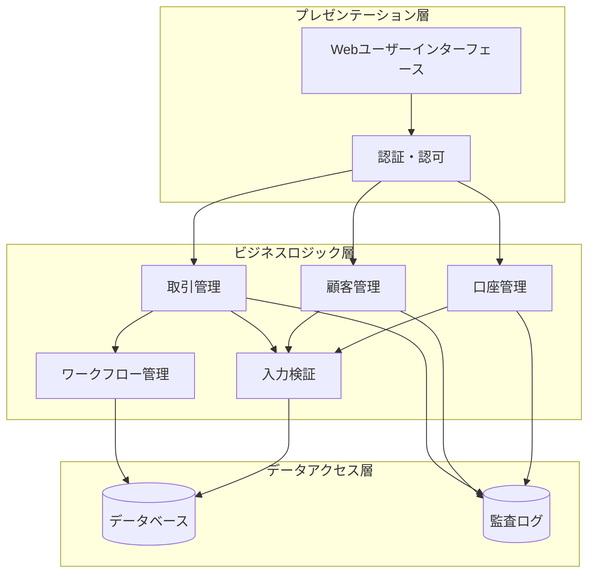
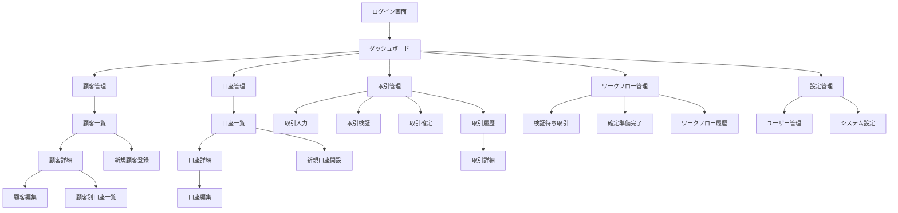

# 設計文書

## 概要

金融系業務アプリケーションは、銀行業務における多段階取引処理ワークフローを実装する Web ベースのアプリケーションです。本システムは、一次入力、ダブルチェック、確定処理の 3 段階承認プロセスを通じて、金融取引の適切な統制と監査証跡を提供します。

### 主要設計原則

- **二重統制**: すべての金融取引は複数の職員による承認を必要とする
- **監査証跡**: すべての操作は完全な履歴とタイムスタンプで記録される
- **データ整合性**: アトミック操作により残高更新の一貫性を保証する
- **役割ベースアクセス**: 利用者の役割に応じた機能制限を実装する
- **入力検証**: 包括的な検証により不正データの入力を防止する

## アーキテクチャ

### システム構成

本システムは 3 層アーキテクチャを採用します：



### 技術スタック

- **フロントエンド**: React 18 + TypeScript + Material-UI v5 + React Router DOM v7
- **バックエンド**: Node.js + Express.js + TypeScript
- **データベース**: PostgreSQL + Prisma ORM v6
- **認証**: bcryptによるパスワードハッシュ化
- **セッション管理**: LocalStorage（開発環境）
- **ログ管理**: Console logging（開発環境）
- **ビルドツール**: Vite
- **テストフレームワーク**: Jest + React Testing Library

## コンポーネントとインターフェース

### 1. 認証・認可コンポーネント

```typescript
interface AuthenticationService {
  login(userId: string, password: string): Promise<AuthResult>;
  logout(sessionId: string): Promise<void>;
  switchUser(
    currentSession: string,
    newUserId: string,
    password: string
  ): Promise<AuthResult>;
  validateSession(sessionId: string): Promise<UserSession>;
}

interface AuthResult {
  success: boolean;
  sessionId?: string;
  userRole?: UserRole;
  errorMessage?: string;
}

enum UserRole {
  GENERAL_STAFF = 'general_staff',
  ADMINISTRATOR = 'administrator',
}
```

### 2. 顧客管理コンポーネント

```typescript
interface CustomerService {
  createCustomer(customerData: CustomerData): Promise<Customer>;
  updateCustomer(
    customerId: string,
    updates: Partial<CustomerData>
  ): Promise<Customer>;
  deleteCustomer(customerId: string): Promise<void>;
  getCustomer(customerId: string): Promise<Customer>;
  searchCustomers(criteria: CustomerSearchCriteria): Promise<Customer[]>;
  listCustomers(
    pagination: PaginationOptions
  ): Promise<PaginatedResult<Customer>>;
}

interface Customer {
  customerId: string;
  name: string;
  phoneticName: string;
  customerType: CustomerType;
  contactInfo: ContactInfo;
  createdAt: Date;
  updatedAt: Date;
  isDeleted: boolean;
}

enum CustomerType {
  INDIVIDUAL = 'individual',
  CORPORATE = 'corporate',
}
```

### 3. 口座管理コンポーネント

```typescript
interface AccountService {
  openAccount(customerId: string, accountData: AccountData): Promise<Account>;
  updateAccount(
    accountId: string,
    updates: Partial<AccountData>
  ): Promise<Account>;
  closeAccount(accountId: string): Promise<void>;
  getAccount(accountId: string): Promise<Account>;
  getAccountsByCustomer(customerId: string): Promise<Account[]>;
  searchAccounts(criteria: AccountSearchCriteria): Promise<Account[]>;
  getAccountBalance(accountId: string): Promise<AccountBalance>;
}

interface Account {
  accountId: string;
  customerId: string;
  accountNumber: string;
  accountType: AccountType;
  status: AccountStatus;
  balance: number;
  createdAt: Date;
  updatedAt: Date;
}

enum AccountStatus {
  ACTIVE = 'active',
  CLOSED = 'closed',
  SUSPENDED = 'suspended',
}
```

### 4. 取引管理コンポーネント

```typescript
interface TransactionService {
  createTransaction(transactionData: TransactionInput): Promise<Transaction>;
  getTransactionsPendingVerification(): Promise<Transaction[]>;
  verifyTransaction(
    transactionId: string,
    verification: TransactionVerification
  ): Promise<void>;
  getTransactionsReadyForConfirmation(): Promise<Transaction[]>;
  confirmTransaction(transactionId: string): Promise<TransactionResult>;
  cancelTransaction(transactionId: string): Promise<void>;
  getTransactionHistory(
    criteria: TransactionSearchCriteria
  ): Promise<Transaction[]>;
}

interface Transaction {
  transactionId: string;
  type: TransactionType;
  sourceAccountId?: string;
  destinationAccountId?: string;
  amount: number;
  description: string;
  status: TransactionStatus;
  createdBy: string;
  verifiedBy?: string;
  confirmedBy?: string;
  createdAt: Date;
  verifiedAt?: Date;
  confirmedAt?: Date;
}

enum TransactionType {
  TRANSFER = 'transfer',
  DEPOSIT = 'deposit',
  WITHDRAWAL = 'withdrawal',
}

enum TransactionStatus {
  PENDING_VERIFICATION = 'pending_verification',
  VERIFICATION_COMPLETE = 'verification_complete',
  ON_HOLD = 'on_hold',
  RETURNED_FOR_CORRECTION = 'returned_for_correction',
  CONFIRMED = 'confirmed',
  CANCELLED = 'cancelled',
}
```

### 5. ワークフロー管理コンポーネント

```typescript
interface WorkflowService {
  validateTransactionTransition(
    transactionId: string,
    newStatus: TransactionStatus,
    userId: string
  ): Promise<boolean>;
  enforceDoubleCheckRule(
    transactionId: string,
    verifyingUserId: string
  ): Promise<boolean>;
  processStatusChange(
    transactionId: string,
    newStatus: TransactionStatus,
    comments?: string
  ): Promise<void>;
  getWorkflowHistory(transactionId: string): Promise<WorkflowStep[]>;
}

interface WorkflowStep {
  stepId: string;
  transactionId: string;
  fromStatus: TransactionStatus;
  toStatus: TransactionStatus;
  performedBy: string;
  performedAt: Date;
  comments?: string;
}
```

## データモデル

### データベーススキーマ

```sql
-- 利用者テーブル
CREATE TABLE users (
    user_id VARCHAR(50) PRIMARY KEY,
    password_hash VARCHAR(255) NOT NULL,
    user_role VARCHAR(20) NOT NULL,
    is_active BOOLEAN DEFAULT true,
    created_at TIMESTAMP DEFAULT CURRENT_TIMESTAMP,
    updated_at TIMESTAMP DEFAULT CURRENT_TIMESTAMP
);

-- 顧客テーブル
CREATE TABLE customers (
    customer_id VARCHAR(50) PRIMARY KEY,
    name VARCHAR(100) NOT NULL,
    phonetic_name VARCHAR(100) NOT NULL,
    customer_type VARCHAR(20) NOT NULL,
    contact_info JSONB,
    is_deleted BOOLEAN DEFAULT false,
    created_at TIMESTAMP DEFAULT CURRENT_TIMESTAMP,
    updated_at TIMESTAMP DEFAULT CURRENT_TIMESTAMP
);

-- 口座テーブル
CREATE TABLE accounts (
    account_id VARCHAR(50) PRIMARY KEY,
    customer_id VARCHAR(50) REFERENCES customers(customer_id),
    account_number VARCHAR(20) UNIQUE NOT NULL,
    account_type VARCHAR(20) NOT NULL,
    status VARCHAR(20) NOT NULL,
    balance DECIMAL(15,2) DEFAULT 0.00,
    created_at TIMESTAMP DEFAULT CURRENT_TIMESTAMP,
    updated_at TIMESTAMP DEFAULT CURRENT_TIMESTAMP
);

-- 取引テーブル
CREATE TABLE transactions (
    transaction_id VARCHAR(50) PRIMARY KEY,
    transaction_type VARCHAR(20) NOT NULL,
    source_account_id VARCHAR(50) REFERENCES accounts(account_id),
    destination_account_id VARCHAR(50) REFERENCES accounts(account_id),
    amount DECIMAL(15,2) NOT NULL,
    description TEXT,
    status VARCHAR(30) NOT NULL,
    created_by VARCHAR(50) REFERENCES users(user_id),
    verified_by VARCHAR(50) REFERENCES users(user_id),
    confirmed_by VARCHAR(50) REFERENCES users(user_id),
    created_at TIMESTAMP DEFAULT CURRENT_TIMESTAMP,
    verified_at TIMESTAMP,
    confirmed_at TIMESTAMP
);

-- ワークフロー履歴テーブル
CREATE TABLE workflow_history (
    step_id VARCHAR(50) PRIMARY KEY,
    transaction_id VARCHAR(50) REFERENCES transactions(transaction_id),
    from_status VARCHAR(30),
    to_status VARCHAR(30) NOT NULL,
    performed_by VARCHAR(50) REFERENCES users(user_id),
    performed_at TIMESTAMP DEFAULT CURRENT_TIMESTAMP,
    comments TEXT
);

-- 監査ログテーブル
CREATE TABLE audit_logs (
    log_id VARCHAR(50) PRIMARY KEY,
    user_id VARCHAR(50) REFERENCES users(user_id),
    action VARCHAR(50) NOT NULL,
    entity_type VARCHAR(20) NOT NULL,
    entity_id VARCHAR(50) NOT NULL,
    old_values JSONB,
    new_values JSONB,
    timestamp TIMESTAMP DEFAULT CURRENT_TIMESTAMP
);
```

### データ整合性制約

- 口座残高は負の値を許可しない
- 取引金額は正の値のみ許可
- 自己参照取引（同一口座間の振込）を防止
- 削除された顧客の口座は新規作成不可
- 解約済み口座での取引を防止

## 正当性プロパティ

プロパティとは、システムのすべての有効な実行において真であるべき特性や動作のことです。これらは人間が読める仕様と機械で検証可能な正当性保証の橋渡しとなる形式的な記述です。

### プロパティ 1: 認証成功の一貫性

*任意の*有効な利用者認証情報に対して、認証処理は成功し、適切な役割に基づくアクセス権限を付与すること
**検証対象: 要件 1.1**

### プロパティ 2: 認証失敗の一貫性

*任意の*無効な利用者認証情報に対して、認証処理は失敗し、適切なエラーメッセージを表示すること
**検証対象: 要件 1.2**

### プロパティ 3: ログアウト処理の完全性

*任意の*アクティブなセッションに対して、ログアウト操作はセッションを完全に終了し、認証状態をクリアすること
**検証対象: 要件 1.4**

### プロパティ 4: 利用者切替の再認証要求

*任意の*利用者切替操作において、システムは新しい利用者の認証情報を要求し、検証すること
**検証対象: 要件 1.5**

### プロパティ 5: 顧客作成時の一意性保証

*任意の*有効な顧客データに対して、顧客作成処理は一意の顧客番号を割り当て、重複を防止すること
**検証対象: 要件 2.1**

### プロパティ 6: 顧客更新時の監査証跡

*任意の*顧客情報更新操作において、システムは変更前後の値を含む監査証跡を作成すること
**検証対象: 要件 2.2**

### プロパティ 7: 顧客削除時の制約検証

*任意の*アクティブな口座を持つ顧客に対して、削除操作は拒否され、適切なエラーメッセージを表示すること
**検証対象: 要件 2.3**

### プロパティ 8: 顧客検索の正確性

*任意の*検索条件（顧客番号、氏名、カナ、個人／法人区分）に対して、該当するすべての顧客のみが結果に含まれること
**検証対象: 要件 2.5**

### プロパティ 9: 口座開設時の一意性保証

*任意の*有効な口座データに対して、口座開設処理は一意の口座番号を割り当て、重複を防止すること
**検証対象: 要件 3.1**

### プロパティ 10: 口座更新の整合性

*任意の*口座情報更新操作において、システムは変更を検証し、口座状態を適切に更新すること
**検証対象: 要件 3.2**

### プロパティ 11: 口座解約時の残高制約

*任意の*残高がゼロでない口座に対して、解約操作は拒否され、適切なエラーメッセージを表示すること
**検証対象: 要件 3.3**

### プロパティ 12: 顧客別口座表示の正確性

*任意の*顧客に対して、口座一覧表示はその顧客に属するすべての口座のみを表示すること
**検証対象: 要件 3.4**

### プロパティ 13: 口座検索の正確性

*任意の*検索条件（口座番号、種別、状態）に対して、該当するすべての口座のみが結果に含まれること
**検証対象: 要件 3.5**

### プロパティ 14: 取引入力時の必須項目検証

*任意の*取引タイプ（振込、入金、出金）において、必須項目が不足している場合、取引作成は拒否され、適切なエラーメッセージを表示すること
**検証対象: 要件 4.1, 4.2, 4.3**

### プロパティ 15: 取引金額の検証

*任意の*取引において、無効な金額形式または上限を超える金額の場合、取引は拒否され、適切なエラーメッセージを表示すること
**検証対象: 要件 4.4**

### プロパティ 16: 取引日の検証

*任意の*取引において、無効な日付形式または非営業日の場合、取引は拒否され、適切なエラーメッセージを表示すること
**検証対象: 要件 4.5**

### プロパティ 17: 取引作成時の初期状態

*任意の*有効な取引データに対して、取引作成後の状態は「検証待ち」であること
**検証対象: 要件 4.7**

### プロパティ 18: 口座表示形式の一貫性

*任意の*口座選択画面において、口座は「顧客名：口座番号 (残高: ¥金額)」の形式で表示されること
**検証対象: 要件 4.8**

### プロパティ 19: 検証待ち取引の表示

*任意の*時点において、検証待ち取引リストには「検証待ち」状態の取引のみが含まれること
**検証対象: 要件 5.1**

### プロパティ 20: 取引差し戻し処理

*任意の*検証待ち取引に対して、差し戻し操作は取引状態を「修正差戻し」に変更し、コメントを記録すること
**検証対象: 要件 5.3**

### プロパティ 21: 取引保留処理

*任意の*検証待ち取引に対して、保留操作は取引状態を「承認保留」に変更し、理由を記録すること
**検証対象: 要件 5.4**

### プロパティ 22: 取引検証完了処理

*任意の*検証待ち取引に対して、検証完了操作は取引状態を「検証完了」に変更すること
**検証対象: 要件 5.5**

### プロパティ 23: 自己検証防止

*任意の*取引において、取引作成者と検証者が同一の場合、検証操作は拒否され、適切なエラーメッセージを表示すること
**検証対象: 要件 5.6**

### プロパティ 24: 確定準備完了取引の表示

*任意の*時点において、確定準備完了取引リストには「検証完了」状態の取引のみが含まれること
**検証対象: 要件 6.1**

### プロパティ 25: 取引確定時の残高更新

*任意の*検証完了取引に対して、確定操作は関連口座の残高を正確に更新し、取引状態を「確定」に変更すること
**検証対象: 要件 6.2**

### プロパティ 26: 取引取消の時間制約

*任意の*確定済み取引において、確定日が当日でない場合、取消操作は拒否され、適切なエラーメッセージを表示すること
**検証対象: 要件 6.3**

### プロパティ 27: 完了取引履歴の表示

*任意の*時点において、取引履歴リストには「確定」状態の取引のみが含まれること
**検証対象: 要件 7.1**

### プロパティ 28: 取引履歴検索の正確性

*任意の*検索条件（期間、顧客、口座、取引種別）に対して、該当するすべての取引のみが結果に含まれること
**検証対象: 要件 7.2**

### プロパティ 29: 必須フィールド検証

*任意の*フォームにおいて、必須フィールドが空の場合、送信は拒否され、不足フィールドが明示されること
**検証対象: 要件 8.1**

### プロパティ 30: 形式検証

*任意の*入力において、無効な数値または日付形式の場合、入力は拒否され、適切な形式エラーメッセージを表示すること
**検証対象: 要件 8.2**

### プロパティ 31: 金額上限検証

*任意の*取引において、設定された上限を超える金額の場合、取引は拒否され、適切な警告メッセージを表示すること
**検証対象: 要件 8.3**

### プロパティ 32: 状態遷移制約

*任意の*取引において、現在の状態から無効な状態への遷移要求は拒否され、適切なエラーメッセージを表示すること
**検証対象: 要件 8.4**

### プロパティ 33: データ引き継ぎの一貫性

*任意の*画面遷移において、前画面で選択されたデータは次画面で正確に引き継がれること
**検証対象: 要件 10.2**

### プロパティ 34: ワークフロー順序の強制

*任意の*取引処理において、入力 → 検証 → 確定の順序が強制され、順序違反は拒否されること
**検証対象: 要件 10.3**

### プロパティ 36: ルーティング状態の一貫性

*任意の*画面遷移において、URLとアプリケーション状態が一致し、ブラウザの戻る・進むボタンが正常に動作すること
**検証対象: 要件 12.2**

### プロパティ 37: 認証ガードの有効性

*任意の*保護されたルートへのアクセスにおいて、未認証の場合はログイン画面にリダイレクトされること
**検証対象: 要件 12.3**

### プロパティ 38: 権限制御の正確性

*任意の*管理者限定機能において、一般行員のアクセスは拒否され、適切なエラーページが表示されること
**検証対象: 要件 12.4**

### プロパティ 39: Material-UIコンポーネントの一貫性

*任意の*画面において、Material-UIコンポーネントが統一されたデザインシステムに従って表示されること
**検証対象: 要件 13.1**

### プロパティ 40: リアルタイム検証の即応性

*任意の*フォーム入力において、入力値の変更に対してリアルタイムで検証フィードバックが提供されること
**検証対象: 要件 13.5**

## エラーハンドリング

### エラー分類と処理戦略

#### 1. 入力検証エラー

- **必須項目未入力**: フィールドレベルでの即座な検証とハイライト表示
- **形式エラー**: リアルタイム検証による即座のフィードバック
- **ビジネスルール違反**: 操作実行時の検証と詳細なエラーメッセージ

#### 2. 認証・認可エラー

- **認証失敗**: セキュリティを考慮した汎用的なエラーメッセージ
- **セッション期限切れ**: 自動的なログイン画面への遷移
- **権限不足**: 操作不可の明確な通知

#### 3. データ整合性エラー

- **同時更新競合**: 楽観的ロックによる競合検出と再試行促進
- **外部キー制約違反**: 関連データの存在確認と適切なガイダンス
- **一意制約違反**: 重複データの明確な指摘と代替案提示

#### 4. システムエラー

- **データベース接続エラー**: 一時的な障害として処理し、再試行を促進
- **外部システム連携エラー**: 障害の影響範囲を明確化し、代替手段を提示
- **予期しないエラー**: 安全な状態への復旧とサポートへの連絡方法を提示

### エラーメッセージ設計原則

1. **具体性**: 何が問題で、どう解決すべきかを明確に示す
2. **一貫性**: 同種のエラーには統一されたメッセージパターンを使用
3. **建設性**: 問題の解決方法や次のアクションを提示
4. **セキュリティ**: 機密情報の漏洩を防ぐ適切な抽象化

## ルーティング設計

### URL構造とナビゲーション

本アプリケーションは React Router DOM を使用したシングルページアプリケーション（SPA）として実装されます。以下にURL構造と画面の対応関係を定義します。

#### URL階層構造

```
/                           # ダッシュボード（ログイン後のホーム画面）
├── /login                  # ログイン画面
├── /customers              # 顧客管理
│   ├── /list              # 顧客一覧
│   ├── /create            # 新規顧客登録
│   ├── /:customerId       # 顧客詳細
│   ├── /:customerId/edit  # 顧客編集
│   └── /:customerId/accounts # 顧客別口座一覧
├── /accounts               # 口座管理
│   ├── /list              # 口座一覧
│   ├── /create            # 新規口座開設
│   ├── /:accountId        # 口座詳細
│   └── /:accountId/edit   # 口座編集
├── /transactions           # 取引管理
│   ├── /input             # 取引入力
│   ├── /verification      # 取引検証
│   ├── /confirmation      # 取引確定
│   ├── /history           # 取引履歴
│   └── /:transactionId    # 取引詳細
├── /workflow               # ワークフロー管理
│   ├── /pending           # 検証待ち取引
│   ├── /ready             # 確定準備完了取引
│   └── /history           # ワークフロー履歴
├── /settings               # 設定管理
│   ├── /users             # ユーザー管理（管理者のみ）
│   └── /system            # システム設定（管理者のみ）
└── /error                  # エラーページ
    ├── /401               # 認証エラー
    ├── /404               # ページが見つからない
    └── /500               # サーバーエラー
```

#### 画面とURLの対応表

| 画面名           | URL                               | コンポーネント            | 認証要否 | 管理者限定 | 説明                         |
| ---------------- | --------------------------------- | ------------------------- | -------- | ---------- | ---------------------------- |
| ログイン画面     | `/login`                          | `LoginScreen`             | 不要     | -          | 利用者認証画面               |
| ダッシュボード   | `/`                               | `Dashboard`               | 必要     | -          | ログイン後のホーム画面       |
| 顧客管理トップ   | `/customers`                      | `CustomerManagement`      | 必要     | -          | 顧客管理メニュー             |
| 顧客一覧         | `/customers/list`                 | `CustomerList`            | 必要     | -          | 顧客検索・一覧表示           |
| 顧客詳細         | `/customers/:customerId`          | `CustomerDetail`          | 必要     | -          | 個別顧客の詳細情報           |
| 顧客編集         | `/customers/:customerId/edit`     | `CustomerEdit`            | 必要     | -          | 顧客情報の編集               |
| 新規顧客登録     | `/customers/create`               | `CustomerCreate`          | 必要     | -          | 新規顧客の登録               |
| 顧客別口座一覧   | `/customers/:customerId/accounts` | `CustomerAccounts`        | 必要     | -          | 特定顧客の口座一覧           |
| 口座管理トップ   | `/accounts`                       | `AccountManagement`       | 必要     | -          | 口座管理メニュー             |
| 口座一覧         | `/accounts/list`                  | `AccountList`             | 必要     | -          | 口座検索・一覧表示           |
| 口座詳細         | `/accounts/:accountId`            | `AccountDetail`           | 必要     | -          | 個別口座の詳細情報           |
| 口座編集         | `/accounts/:accountId/edit`       | `AccountEdit`             | 必要     | -          | 口座情報の編集               |
| 新規口座開設     | `/accounts/create`                | `AccountCreate`           | 必要     | -          | 新規口座の開設               |
| 取引管理トップ   | `/transactions`                   | `TransactionManagement`   | 必要     | -          | 取引管理メニュー             |
| 取引入力         | `/transactions/input`             | `TransactionInput`        | 必要     | -          | 新規取引の入力               |
| 取引検証         | `/transactions/verification`      | `TransactionVerification` | 必要     | -          | 取引のダブルチェック         |
| 取引確定         | `/transactions/confirmation`      | `TransactionConfirmation` | 必要     | ✓          | 取引の最終確定（管理者のみ） |
| 取引履歴         | `/transactions/history`           | `TransactionHistory`      | 必要     | -          | 完了取引の履歴照会           |
| 取引詳細         | `/transactions/:transactionId`    | `TransactionDetail`       | 必要     | -          | 個別取引の詳細情報           |
| ワークフロー管理 | `/workflow`                       | `WorkflowManagement`      | 必要     | -          | ワークフロー管理メニュー     |
| 検証待ち取引     | `/workflow/pending`               | `WorkflowPending`         | 必要     | -          | 検証待ち取引の一覧           |
| 確定準備完了     | `/workflow/ready`                 | `WorkflowReady`           | 必要     | -          | 確定準備完了取引の一覧       |
| ワークフロー履歴 | `/workflow/history`               | `WorkflowHistory`         | 必要     | -          | ワークフロー変更履歴         |
| 設定管理         | `/settings`                       | `SettingsManagement`      | 必要     | -          | 設定管理メニュー             |
| ユーザー管理     | `/settings/users`                 | `UserManagement`          | 必要     | ✓          | ユーザー管理（管理者のみ）   |
| システム設定     | `/settings/system`                | `SystemConfig`            | 必要     | ✓          | システム設定（管理者のみ）   |
| 認証エラー       | `/401`                            | `UnauthorizedError`       | 不要     | -          | 認証・認可エラー画面         |
| ページ未発見     | `/404`                            | `NotFoundError`           | 不要     | -          | 存在しないページエラー       |
| サーバーエラー   | `/500`                            | `ServerError`             | 不要     | -          | サーバーエラー画面           |

#### ナビゲーション設計原則

1. **階層的構造**: 機能ごとに論理的な階層を持つURL構造
2. **RESTful設計**: リソース指向のURL設計（顧客、口座、取引）
3. **パンくずナビゲーション**: 現在位置の明確化と上位階層への移動
4. **ディープリンク対応**: 直接URLアクセスでの適切な画面表示
5. **認証状態管理**: 未認証時の自動ログイン画面リダイレクト

#### 画面遷移フロー



#### 認証・認可制御

- **認証ガード**: 保護されたルートへのアクセス時に認証状態を確認
- **役割ベースアクセス**: 管理者限定機能への適切なアクセス制御
- **セッション管理**: セッション期限切れ時の自動ログイン画面遷移
- **リダイレクト**: ログイン成功後の元画面への自動遷移

#### パフォーマンス最適化

- **コード分割**: ルートレベルでの動的インポートによる初期読み込み最適化
- **プリロード**: 予測される次画面のコンポーネント事前読み込み
- **キャッシュ戦略**: 静的リソースとAPIレスポンスの適切なキャッシュ
- **遅延読み込み**: 大きなコンポーネントの必要時読み込み

## API設計

### RESTful API エンドポイント一覧

本システムは RESTful な設計原則に基づいたAPI構造を採用します。すべてのAPIエンドポイントは `/api` プレフィックスを持ちます。

#### 基本情報

- **ベースURL**: `http://localhost:3001/api`
- **認証方式**: JWT Bearer Token（実装予定）
- **データ形式**: JSON
- **文字エンコーディング**: UTF-8

#### 共通レスポンス形式

```typescript
interface ApiResponse<T = any> {
  success: boolean;
  data?: T;
  message?: string;
  timestamp?: string;
  errors?: string[];
}

interface PaginatedResponse<T> extends ApiResponse<T[]> {
  pagination: {
    page: number;
    limit: number;
    total: number;
    totalPages: number;
  };
}
```

### 1. 認証・認可 API

| メソッド | エンドポイント           | 説明                 | 実装状況    |
| -------- | ------------------------ | -------------------- | ----------- |
| POST     | `/api/auth/login`        | ユーザーログイン     | ✅ 実装済み |
| POST     | `/api/auth/logout`       | ユーザーログアウト   | ✅ 実装済み |
| GET      | `/api/auth/user/:userId` | ユーザー情報取得     | ✅ 実装済み |
| POST     | `/api/auth/refresh`      | トークンリフレッシュ | 🔄 実装予定 |
| POST     | `/api/auth/switch-user`  | ユーザー切替         | 🔄 実装予定 |

#### ログイン API 詳細

```typescript
// POST /api/auth/login
interface LoginRequest {
  userId: string;
  password: string;
}

interface LoginResponse {
  success: boolean;
  user?: {
    userId: string;
    userRole: 'general_staff' | 'administrator';
  };
  token?: string; // 実装予定
  message: string;
}
```

### 2. 顧客管理 API

| メソッド | エンドポイント               | 説明                    | 実装状況    |
| -------- | ---------------------------- | ----------------------- | ----------- |
| GET      | `/api/customers/list`        | 顧客一覧取得            | ✅ 実装済み |
| GET      | `/api/customers/search`      | 顧客検索                | ✅ 実装済み |
| GET      | `/api/customers/details`     | 顧客詳細取得            | ✅ 実装済み |
| GET      | `/api/customers/:customerId` | 顧客詳細取得（RESTful） | 🔄 実装予定 |
| POST     | `/api/customers`             | 新規顧客作成            | 🔄 実装予定 |
| PUT      | `/api/customers/:customerId` | 顧客情報更新            | 🔄 実装予定 |
| DELETE   | `/api/customers/:customerId` | 顧客削除（論理削除）    | 🔄 実装予定 |

#### 顧客検索 API 詳細

```typescript
// GET /api/customers/search
interface CustomerSearchParams {
  customerId?: string;
  name?: string;
  phoneticName?: string;
  customerType?: 'individual' | 'corporate';
  page?: number;
  limit?: number;
}

interface CustomerResponse {
  customerId: string;
  name: string;
  phoneticName: string;
  customerType: 'individual' | 'corporate';
  contactInfo: {
    email?: string;
    phone?: string;
    address?: string;
    postalCode?: string;
  };
  createdAt: string;
  updatedAt: string;
}
```

### 3. 口座管理 API

| メソッド | エンドポイント                        | 説明           | 実装状況    |
| -------- | ------------------------------------- | -------------- | ----------- |
| GET      | `/api/accounts`                       | 口座一覧取得   | 🔄 実装予定 |
| GET      | `/api/accounts/:accountId`            | 口座詳細取得   | 🔄 実装予定 |
| GET      | `/api/customers/:customerId/accounts` | 顧客別口座一覧 | 🔄 実装予定 |
| POST     | `/api/accounts`                       | 新規口座開設   | 🔄 実装予定 |
| PUT      | `/api/accounts/:accountId`            | 口座情報更新   | 🔄 実装予定 |
| DELETE   | `/api/accounts/:accountId`            | 口座解約       | 🔄 実装予定 |
| GET      | `/api/accounts/:accountId/balance`    | 口座残高取得   | 🔄 実装予定 |

#### 口座開設 API 詳細

```typescript
// POST /api/accounts
interface AccountCreateRequest {
  customerId: string;
  accountType: 'savings' | 'checking' | 'fixed_deposit';
  initialBalance?: number;
}

interface AccountResponse {
  accountId: string;
  customerId: string;
  accountNumber: string;
  accountType: 'savings' | 'checking' | 'fixed_deposit';
  status: 'active' | 'closed' | 'suspended';
  balance: number;
  createdAt: string;
  updatedAt: string;
}
```

### 4. 取引管理 API

| メソッド | エンドポイント                             | 説明                 | 実装状況    |
| -------- | ------------------------------------------ | -------------------- | ----------- |
| GET      | `/api/transactions`                        | 取引一覧取得         | 🔄 実装予定 |
| GET      | `/api/transactions/:transactionId`         | 取引詳細取得         | 🔄 実装予定 |
| POST     | `/api/transactions`                        | 新規取引作成         | 🔄 実装予定 |
| PUT      | `/api/transactions/:transactionId/verify`  | 取引検証             | 🔄 実装予定 |
| PUT      | `/api/transactions/:transactionId/confirm` | 取引確定             | 🔄 実装予定 |
| PUT      | `/api/transactions/:transactionId/cancel`  | 取引取消             | 🔄 実装予定 |
| GET      | `/api/transactions/pending`                | 検証待ち取引一覧     | 🔄 実装予定 |
| GET      | `/api/transactions/ready`                  | 確定準備完了取引一覧 | 🔄 実装予定 |
| GET      | `/api/transactions/history`                | 取引履歴取得         | 🔄 実装予定 |

#### 取引作成 API 詳細

```typescript
// POST /api/transactions
interface TransactionCreateRequest {
  type: 'transfer' | 'deposit' | 'withdrawal';
  sourceAccountId?: string;
  destinationAccountId?: string;
  amount: number;
  description: string;
}

interface TransactionResponse {
  transactionId: string;
  type: 'transfer' | 'deposit' | 'withdrawal';
  sourceAccountId?: string;
  destinationAccountId?: string;
  amount: number;
  description: string;
  status:
    | 'pending_verification'
    | 'verification_complete'
    | 'on_hold'
    | 'returned_for_correction'
    | 'confirmed'
    | 'cancelled';
  createdBy: string;
  verifiedBy?: string;
  confirmedBy?: string;
  createdAt: string;
  verifiedAt?: string;
  confirmedAt?: string;
}
```

### 5. ワークフロー管理 API

| メソッド | エンドポイント                         | 説明                   | 実装状況    |
| -------- | -------------------------------------- | ---------------------- | ----------- |
| GET      | `/api/workflow/history/:transactionId` | ワークフロー履歴取得   | 🔄 実装予定 |
| POST     | `/api/workflow/transition`             | 状態遷移実行           | 🔄 実装予定 |
| GET      | `/api/workflow/rules`                  | ワークフロールール取得 | 🔄 実装予定 |

### 6. システム管理 API

| メソッド | エンドポイント       | 説明                           | 実装状況    |
| -------- | -------------------- | ------------------------------ | ----------- |
| GET      | `/api/health`        | ヘルスチェック                 | ✅ 実装済み |
| GET      | `/api/users`         | ユーザー一覧取得（管理者のみ） | 🔄 実装予定 |
| POST     | `/api/users`         | 新規ユーザー作成（管理者のみ） | 🔄 実装予定 |
| PUT      | `/api/users/:userId` | ユーザー情報更新（管理者のみ） | 🔄 実装予定 |
| GET      | `/api/audit-logs`    | 監査ログ取得（管理者のみ）     | 🔄 実装予定 |

### エラーハンドリング

#### HTTPステータスコード

- **200 OK**: 正常処理完了
- **201 Created**: リソース作成成功
- **400 Bad Request**: 不正なリクエスト（バリデーションエラー）
- **401 Unauthorized**: 認証エラー
- **403 Forbidden**: 認可エラー（権限不足）
- **404 Not Found**: リソースが見つからない
- **409 Conflict**: データ競合エラー
- **422 Unprocessable Entity**: ビジネスルール違反
- **500 Internal Server Error**: サーバー内部エラー

#### エラーレスポンス形式

```typescript
interface ErrorResponse {
  success: false;
  message: string;
  errors?: {
    field: string;
    code: string;
    message: string;
  }[];
  timestamp: string;
}
```

### セキュリティ考慮事項

1. **認証・認可**: JWT トークンベースの認証（実装予定）
2. **入力検証**: すべての入力データの厳密な検証
3. **SQLインジェクション対策**: Prisma ORMによる自動エスケープ
4. **CORS設定**: 適切なオリジン制限
5. **レート制限**: API呼び出し頻度の制限（実装予定）
6. **監査ログ**: すべての重要操作の記録

### API開発ガイドライン

1. **RESTful設計**: リソース指向のURL設計
2. **一貫性**: 統一されたレスポンス形式
3. **バージョニング**: 将来的なAPI変更への対応
4. **ドキュメント**: OpenAPI/Swagger仕様書の作成（実装予定）
5. **テスト**: 各エンドポイントの包括的なテスト

## テスト戦略

### 二重テストアプローチ

本システムでは、単体テストとプロパティベーステストの両方を実装し、包括的な品質保証を実現します。

#### 単体テスト

- **具体例の検証**: 特定のシナリオでの正確な動作を確認
- **エッジケース**: 境界値や例外的な条件での動作を検証
- **統合ポイント**: コンポーネント間の連携動作を確認
- **エラー条件**: 異常系での適切なエラーハンドリングを検証

#### プロパティベーステスト

- **普遍的プロパティ**: すべての入力に対して成立すべき性質を検証
- **ランダム入力**: 大量の自動生成データによる包括的なテスト
- **不変条件**: システムの状態不変条件の維持を確認
- **ラウンドトリップ**: データの変換・復元処理の一貫性を検証

### プロパティベーステスト設定

- **テストライブラリ**: fast-check (JavaScript/TypeScript)
- **実行回数**: 各プロパティテストは最低 100 回の反復実行
- **テストタグ**: 各テストには対応する設計プロパティを明記
- **タグ形式**: `**Feature: financial-business-app, Property {番号}: {プロパティ名}**`

### テスト範囲

#### 機能テスト

- 認証・認可機能の完全性
- 顧客・口座管理の CRUD 操作
- 取引ワークフローの状態遷移
- 検索・フィルタリング機能の正確性

#### 非機能テスト

- セキュリティ: 認証バイパス、SQL インジェクション、XSS 攻撃の防御
- パフォーマンス: 大量データでの応答時間とスループット
- 可用性: 障害時の適切な復旧とエラーハンドリング
- 使いやすさ: 操作フローの直感性とエラーメッセージの明確性

### 継続的品質保証

- **自動化テスト**: CI/CD パイプラインでの自動実行
- **コードカバレッジ**: 最低 80%のカバレッジ目標
- **静的解析**: ESLint、TypeScript 厳密モードによるコード品質維持
- **セキュリティスキャン**: 依存関係の脆弱性定期チェック

### テストデータ管理

- **サンプルデータ**: 実際の業務シナリオを反映したテストデータセット
- **データ生成**: プロパティテスト用の制約に基づく自動データ生成
- **データクリーンアップ**: テスト実行後の確実なデータ初期化
- **プライバシー保護**: 本番データの使用禁止と匿名化の徹底
