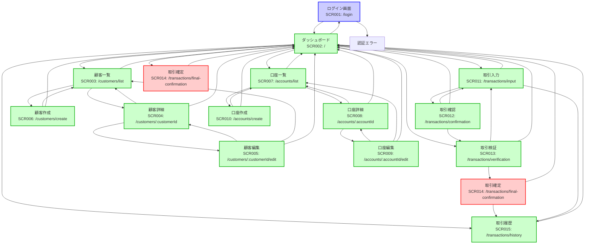
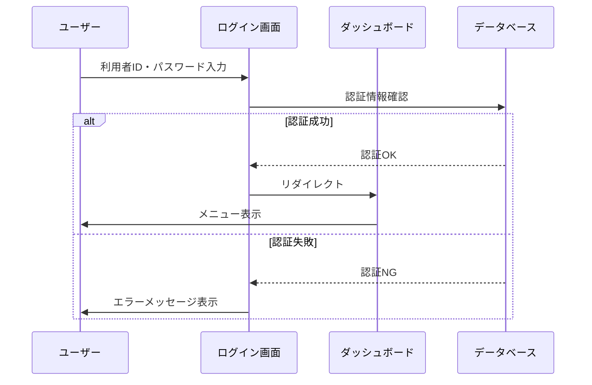
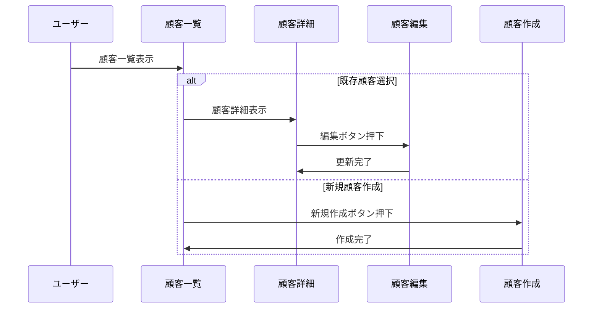
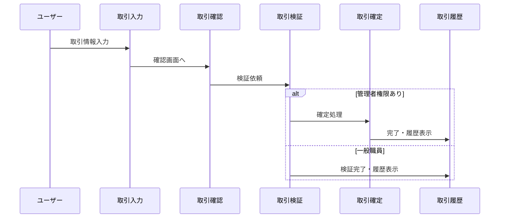

# 金融系業務アプリケーション「ゴブコパ」画面遷移図

## 概要

本ドキュメントは、金融系業務アプリケーション「ゴブコパ」の全体的な画面遷移を図示したものです。各画面間の遷移条件、権限制御、およびワークフローを明確に示しています。

## 画面遷移図



## 権限別アクセス制御

### 🔵 パブリックアクセス（未認証）

- **SCR001**: ログイン画面 (`/login`)

### 🟢 全認証ユーザー（一般職員・管理者）

- **SCR002**: ダッシュボード (`/`)
- **SCR003**: 顧客一覧画面 (`/customers/list`)
- **SCR004**: 顧客詳細画面 (`/customers/:customerId`)
- **SCR005**: 顧客編集画面 (`/customers/:customerId/edit`)
- **SCR006**: 顧客作成画面 (`/customers/create`)
- **SCR007**: 口座一覧画面 (`/accounts/list`)
- **SCR008**: 口座詳細画面 (`/accounts/:accountId`)
- **SCR009**: 口座編集画面 (`/accounts/:accountId/edit`)
- **SCR010**: 口座作成画面 (`/accounts/create`)
- **SCR011**: 取引入力画面 (`/transactions/input`)
- **SCR012**: 取引確認画面 (`/transactions/confirmation`)
- **SCR013**: 取引検証画面 (`/transactions/verification`)
- **SCR015**: 取引履歴画面 (`/transactions/history`)

### 🔴 管理者限定

- **SCR014**: 取引確定画面 (`/transactions/final-confirmation`)

## 主要ワークフロー

### 1. ログイン・認証フロー



### 2. 顧客管理ワークフロー



### 3. 取引処理ワークフロー



## 画面遷移ルール

### 基本ルール

1. **認証チェック**: 全画面で認証状態を確認
2. **権限チェック**: 管理者限定機能は権限確認
3. **セッション管理**: セッション期限切れ時は自動ログアウト
4. **データ整合性**: 関連データの存在確認

### 遷移条件

| 遷移元     | 遷移先         | 条件                     | 備考               |
| ---------- | -------------- | ------------------------ | ------------------ |
| 任意の画面 | ログイン画面   | セッション期限切れ       | 自動リダイレクト   |
| 任意の画面 | ダッシュボード | ホームボタン押下         | 共通ナビゲーション |
| 取引入力   | 取引確認       | 入力値バリデーション成功 | データ引き継ぎ     |
| 取引確認   | 取引検証       | 確認ボタン押下           | データ引き継ぎ     |
| 取引検証   | 取引確定       | 管理者権限 + 検証完了    | 管理者のみ         |
| 顧客詳細   | 顧客編集       | 編集権限あり             | データ引き継ぎ     |
| 口座詳細   | 口座編集       | 編集権限あり             | データ引き継ぎ     |

### エラー時の遷移

| エラー種別     | 遷移先         | 条件                      |
| -------------- | -------------- | ------------------------- |
| 認証エラー     | ログイン画面   | 401 Unauthorized          |
| 権限エラー     | ダッシュボード | 403 Forbidden             |
| データ不存在   | 一覧画面       | 404 Not Found             |
| システムエラー | エラー画面     | 500 Internal Server Error |

## ナビゲーション構造

### グローバルナビゲーション

```
ヘッダー
├── ロゴ（ダッシュボードへのリンク）
├── メインメニュー
│   ├── 顧客管理
│   ├── 口座管理
│   ├── 取引処理
│   └── 取引履歴
└── ユーザーメニュー
    ├── 利用者切替
    └── ログアウト
```

### パンくずナビゲーション

```
ダッシュボード > 顧客管理 > 顧客詳細 > 顧客編集
ダッシュボード > 取引処理 > 取引入力 > 取引確認 > 取引検証
```

## データフロー

### セッション情報

```json
{
  "userId": "USER001",
  "userRole": "GENERAL_STAFF | ADMINISTRATOR",
  "sessionId": "uuid-string",
  "expiresAt": "2024-01-01T12:00:00Z"
}
```

### 画面間データ受け渡し

| 遷移                | データ     | 形式          |
| ------------------- | ---------- | ------------- |
| 取引入力 → 取引確認 | 取引データ | State/Props   |
| 取引確認 → 取引検証 | 取引データ | State/Props   |
| 顧客一覧 → 顧客詳細 | 顧客ID     | URL Parameter |
| 口座一覧 → 口座詳細 | 口座ID     | URL Parameter |

## セキュリティ考慮事項

### 認証・認可

- JWT トークンによるセッション管理
- 画面表示時の権限チェック
- API 呼び出し時の認証ヘッダー

### 監査ログ

- 全画面遷移の記録
- ユーザー操作の追跡
- データ変更の履歴管理

### データ保護

- 機密情報のマスク表示
- HTTPS 通信の強制
- XSS/CSRF 対策の実装

## 実装上の注意点

### ルーティング

- React Router を使用した SPA 構成
- 認証ガードの実装
- 権限別ルート制御

### 状態管理

- Redux/Context API による状態管理
- セッション情報の永続化
- フォームデータの一時保存

### エラーハンドリング

- 統一されたエラー表示
- ユーザーフレンドリーなメッセージ
- 適切な画面遷移

## 今後の拡張予定

### 新機能

- レポート機能（管理者限定）
- バッチ処理監視画面
- システム設定画面

### 改善項目

- モバイル対応
- アクセシビリティ向上
- パフォーマンス最適化

---

**更新履歴**

- 2024-01-11: 初版作成
- 画面遷移図の詳細化
- 権限制御の明確化
- ワークフロー図の追加
